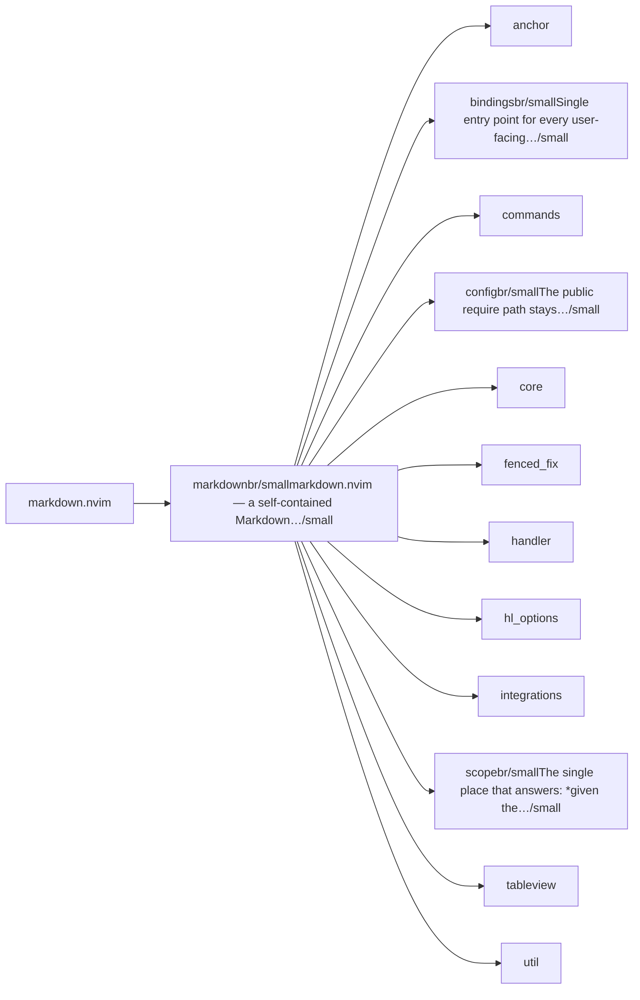
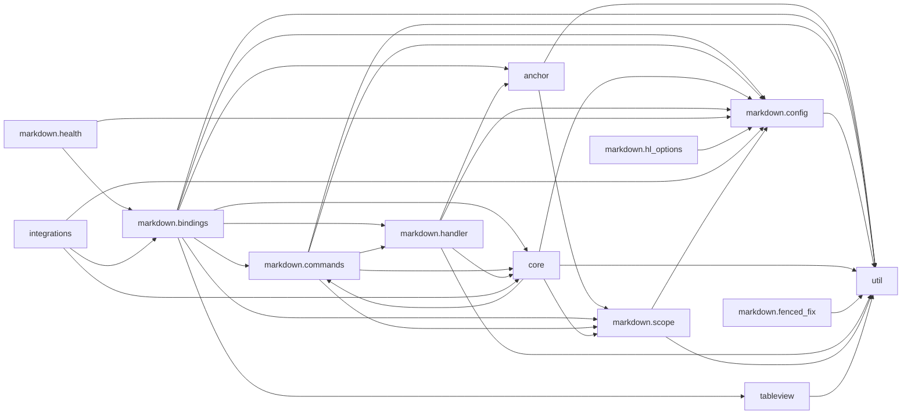

# markdown.nvim — module map

> **Generated** by `documentation`. Do not edit by hand — run `:DocMap`
> (or `nvim --headless -l scripts/gen_map.lua`) to regenerate.

**9 modules** · 8 namespaces · 62 helper files

The [interactive map](index.html) has filtering, full descriptions and
source links; this page is the version the code host renders directly.

## Namespaces

## Dependencies

Which parts of the tree require which, rolled up to the second level.
The [interactive map](index.html)'s **Deps** view has this per module,
in both directions, with load-time and lazy requires told apart.

## Modules

| Module | Description | Fns | Docs |
|---|---|---|---|
| `markdown` | markdown.nvim — a self-contained Markdown toolkit for Neovim. | 11 | [src](../../lua/markdown/init.lua) |
| &nbsp;&nbsp;`anchor` |  |  |  |
| &nbsp;&nbsp;`markdown.bindings` | Single entry point for every user-facing trigger. | 1 | [src](../../lua/markdown/bindings/init.lua) |
| &nbsp;&nbsp;`markdown.commands` |  | 3 | [src](../../lua/markdown/commands/init.lua) |
| &nbsp;&nbsp;`markdown.config` | The public require path stays `markdown.config` (this init.lua). | 5 | [src](../../lua/markdown/config/init.lua) |
| &nbsp;&nbsp;`core` |  |  |  |
| &nbsp;&nbsp;&nbsp;&nbsp;`markdown.core.headline_spacing` | Ensures every H2+ section is closed with a blank/`---`/blank separator. | 7 | [src](../../lua/markdown/core/headline_spacing/init.lua) |
| &nbsp;&nbsp;`markdown.fenced_fix` |  | 7 | [src](../../lua/markdown/fenced_fix/init.lua) |
| &nbsp;&nbsp;`markdown.handler` |  | 10 | [src](../../lua/markdown/handler/init.lua) |
| &nbsp;&nbsp;`markdown.hl_options` |  | 1 | [src](../../lua/markdown/hl_options/init.lua) |
| &nbsp;&nbsp;&nbsp;&nbsp;`hl_groups` |  |  |  |
| &nbsp;&nbsp;`integrations` |  |  |  |
| &nbsp;&nbsp;`markdown.scope` | The single place that answers: *given the cursor, should this markdown operation act on a fenced sub-document or on the whole file?* Every scope-aware op… | 14 | [src](../../lua/markdown/scope/init.lua) |
| &nbsp;&nbsp;`tableview` |  |  |  |
| &nbsp;&nbsp;&nbsp;&nbsp;`views` |  |  |  |
| &nbsp;&nbsp;`util` |  |  |  |

## Drift

0 errors · 17 warnings · 88 info

| Severity | Check | Message |
|---|---|---|
| warn | `doc-references-missing` | docs/ROADMAP/VIM_PORT_ANALYSIS.md:3 references 'markdown.vim', but markdown has no 'vim' |
| warn | `doc-references-missing` | docs/ROADMAP/VIM_PORT_ANALYSIS.md:140 references 'markdown.vim', but markdown has no 'vim' |
| warn | `doc-references-missing` | docs/ROADMAP/VIM_PORT_ANALYSIS.md:118 references 'markdown.vim', but markdown has no 'vim' |
| warn | `doc-references-missing` | docs/ROADMAP/VIM_PORT_ANALYSIS.md:87 references 'markdown.vim', but markdown has no 'vim' |
| warn | `missing-summary` | lua/markdown/commands/init.lua has no description line |
| warn | `missing-summary` | lua/markdown/fenced_fix/init.lua has no description line |
| warn | `missing-summary` | lua/markdown/handler/init.lua has no description line |
| warn | `missing-summary` | lua/markdown/handler/file.lua has no description line |
| warn | `missing-summary` | lua/markdown/handler/image.lua has no description line |
| warn | `missing-summary` | lua/markdown/handler/url.lua has no description line |
| warn | `missing-summary` | lua/markdown/hl_options/init.lua has no description line |
| warn | `missing-summary` | lua/markdown/hl_options/hl_groups/blockquote.lua has no description line |
| warn | `missing-summary` | lua/markdown/tableview/parser.lua has no description line |
| warn | `missing-summary` | lua/markdown/tableview/renderer.lua has no description line |
| warn | `missing-summary` | lua/markdown/tableview/views/browser_basic.lua has no description line |
| warn | `missing-summary` | lua/markdown/tableview/views/browser_niceified.lua has no description line |
| warn | `missing-summary` | lua/markdown/tableview/views/table_selector.lua has no description line |

88 informational findings

| Check | Message |
|---|---|
| `dead-function` | M._op_increase is marked @internal and nothing in the tree calls it |
| `dead-function` | M._op_decrease is marked @internal and nothing in the tree calls it |
| `missing-readme` | lua/markdown has no README.md |
| `missing-readme` | lua/markdown/bindings has no README.md |
| `missing-readme` | lua/markdown/commands has no README.md |
| `missing-readme` | lua/markdown/config has no README.md |
| `missing-readme` | lua/markdown/core/headline_spacing has no README.md |
| `missing-readme` | lua/markdown/fenced_fix has no README.md |
| `missing-readme` | lua/markdown/handler has no README.md |
| `missing-readme` | lua/markdown/hl_options has no README.md |
| `missing-readme` | lua/markdown/scope has no README.md |
| `param-name-mismatch` | select_builtin: @param #3 is documented as 'on_choose' but the signature declares 'format' at that position |
| `undocumented-param` | M.update_toc has 2 parameter(s) but only 0 @param line(s) |
| `undocumented-param` | M.foldexpr has 1 parameter(s) but only 0 @param line(s) |
| `undocumented-param` | M.run has 2 parameter(s) but only 0 @param line(s) |
| `undocumented-param` | get_hl has 1 parameter(s) but only 0 @param line(s) |
| `undocumented-param` | M.setup has 1 parameter(s) but only 0 @param line(s) |
| `undocumented-param` | first_existing_hl has 1 parameter(s) but only 0 @param line(s) |
| `undocumented-param` | set_many has 2 parameter(s) but only 0 @param line(s) |
| `undocumented-param` | safe_set has 2 parameter(s) but only 0 @param line(s) |
| `undocumented-param` | safe_clear has 1 parameter(s) but only 0 @param line(s) |
| `undocumented-param` | search_and_jump_to_fragment has 1 parameter(s) but only 0 @param line(s) |
| `undocumented-param` | resolve_target_path has 1 parameter(s) but only 0 @param line(s) |
| `undocumented-param` | open_file_in_current_window has 1 parameter(s) but only 0 @param line(s) |
| `undocumented-param` | strip_leading_hash has 1 parameter(s) but only 0 @param line(s) |
| `undocumented-param` | slugify has 1 parameter(s) but only 0 @param line(s) |
| `undocumented-param` | escape_lua_pattern has 1 parameter(s) but only 0 @param line(s) |
| `undocumented-param` | M.is_file_line has 1 parameter(s) but only 0 @param line(s) |
| `undocumented-param` | M.open has 1 parameter(s) but only 0 @param line(s) |
| `undocumented-param` | open_with_system_viewer has 1 parameter(s) but only 0 @param line(s) |
| `undocumented-param` | M.resolve has 1 parameter(s) but only 0 @param line(s) |
| `undocumented-param` | resolve_target_to_path has 1 parameter(s) but only 0 @param line(s) |
| `undocumented-param` | M.extract has 1 parameter(s) but only 0 @param line(s) |
| `undocumented-param` | extract_file_target_from_line has 1 parameter(s) but only 0 @param line(s) |
| `undocumented-param` | is_url has 1 parameter(s) but only 0 @param line(s) |
| `undocumented-param` | trim has 1 parameter(s) but only 0 @param line(s) |
| `undocumented-param` | find_href_or_imgsrc_in_buffer_near_cursor has 3 parameter(s) but only 0 @param line(s) |
| `undocumented-param` | M.extract has 1 parameter(s) but only 0 @param line(s) |
| `undocumented-param` | M.resolve has 1 parameter(s) but only 0 @param line(s) |
| `undocumented-param` | M.open has 1 parameter(s) but only 0 @param line(s) |
| `undocumented-param` | open_with_system_viewer has 1 parameter(s) but only 0 @param line(s) |
| `undocumented-param` | resolve_target_to_path has 1 parameter(s) but only 0 @param line(s) |
| `undocumented-param` | M.is_image_line has 1 parameter(s) but only 0 @param line(s) |
| `undocumented-param` | extract_image_target_from_line has 1 parameter(s) but only 0 @param line(s) |
| `undocumented-param` | is_url has 1 parameter(s) but only 0 @param line(s) |
| `undocumented-param` | find_img_src_in_buffer_near_cursor has 3 parameter(s) but only 0 @param line(s) |
| `undocumented-param` | trim has 1 parameter(s) but only 0 @param line(s) |
| `undocumented-param` | M.extract has 1 parameter(s) but only 0 @param line(s) |
| `undocumented-param` | M.open has 1 parameter(s) but only 0 @param line(s) |
| `undocumented-param` | M.is_url_line has 1 parameter(s) but only 0 @param line(s) |
| `undocumented-param` | extract_url_from_line has 1 parameter(s) but only 0 @param line(s) |
| `undocumented-param` | open_with_system_viewer has 1 parameter(s) but only 0 @param line(s) |
| `undocumented-param` | is_explicit_url has 1 parameter(s) but only 0 @param line(s) |
| `undocumented-param` | trim has 1 parameter(s) but only 0 @param line(s) |
| `undocumented-param` | find_href_in_buffer_near_cursor has 3 parameter(s) but only 0 @param line(s) |
| `undocumented-param` | M.setup has 1 parameter(s) but only 0 @param line(s) |
| `undocumented-param` | set_hl has 1 parameter(s) but only 0 @param line(s) |
| `undocumented-param` | M.apply has 1 parameter(s) but only 0 @param line(s) |
| `undocumented-param` | dim_bg has 1 parameter(s) but only 0 @param line(s) |
| `undocumented-param` | is_separator_row has 1 parameter(s) but only 0 @param line(s) |
| `undocumented-param` | M.parse_table has 2 parameter(s) but only 0 @param line(s) |
| `undocumented-param` | parse_row has 1 parameter(s) but only 0 @param line(s) |
| `undocumented-param` | trim has 1 parameter(s) but only 0 @param line(s) |
| `undocumented-param` | parse_alignment has 1 parameter(s) but only 0 @param line(s) |
| `undocumented-param` | ensure_view has 1 parameter(s) but only 0 @param line(s) |
| `undocumented-param` | merge has 2 parameter(s) but only 0 @param line(s) |
| `undocumented-param` | table_to_matrix has 1 parameter(s) but only 0 @param line(s) |
| `undocumented-param` | align_cell has 3 parameter(s) but only 0 @param line(s) |
| `undocumented-param` | format_row_with_alignment has 3 parameter(s) but only 0 @param line(s) |
| `undocumented-param` | set_win_opt has 3 parameter(s) but only 0 @param line(s) |
| `undocumented-param` | M.render_markdowntable has 2 parameter(s) but only 0 @param line(s) |
| `undocumented-param` | clear_highlights has 1 parameter(s) but only 0 @param line(s) |
| `undocumented-param` | M.toggle_markdowntable has 2 parameter(s) but only 0 @param line(s) |
| `undocumented-param` | set_buf_opt has 3 parameter(s) but only 0 @param line(s) |
| `undocumented-param` | html_escape has 1 parameter(s) but only 0 @param line(s) |
| `undocumented-param` | build_html has 2 parameter(s) but only 0 @param line(s) |
| `undocumented-param` | html_escape has 1 parameter(s) but only 0 @param line(s) |
| `undocumented-param` | format_item has 1 parameter(s) but only 0 @param line(s) |
| `undocumented-param` | collapse has 1 parameter(s) but only 0 @param line(s) |
| `undocumented-param` | optional has 1 parameter(s) but only 0 @param line(s) |
| `undocumented-param` | select_fzf has 4 parameter(s) but only 0 @param line(s) |
| `undocumented-param` | select_builtin has 4 parameter(s) but only 3 @param line(s) |
| `undocumented-param` | select_telescope has 4 parameter(s) but only 0 @param line(s) |
| `undocumented-param` | select_hover has 4 parameter(s) but only 0 @param line(s) |
| `unreferenced-module` | markdown is required by no other file in the tree |
| `unreferenced-module` | markdown.anchor.is_anchor_line is required by no other file in the tree |
| `unreferenced-module` | markdown.health is required by no other file in the tree |
| `unreferenced-module` | markdown.integrations.menu is required by no other file in the tree |

